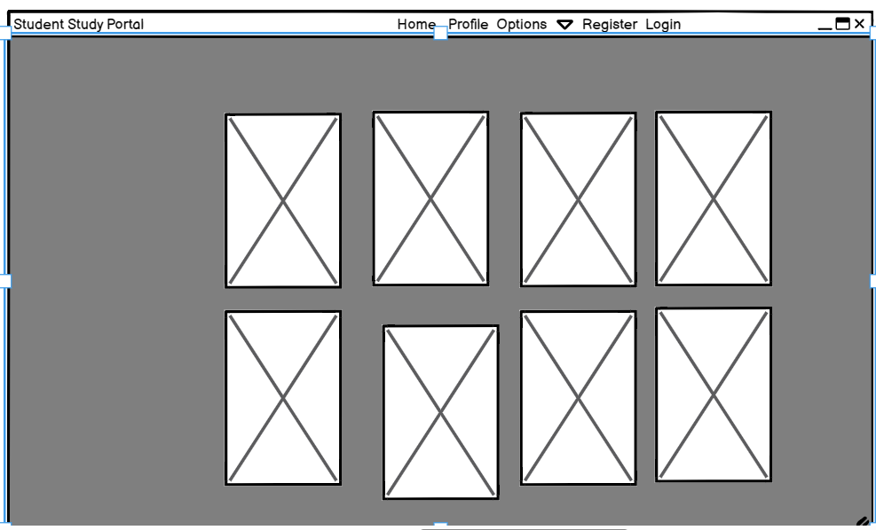
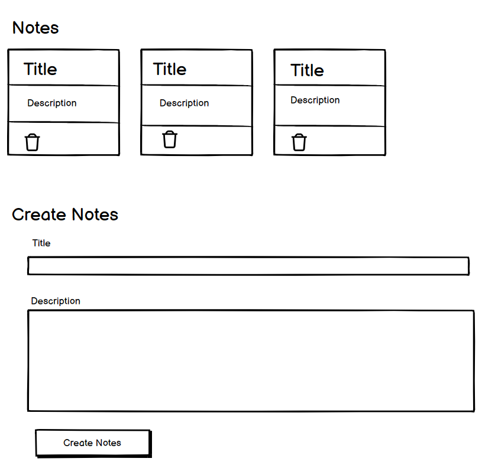
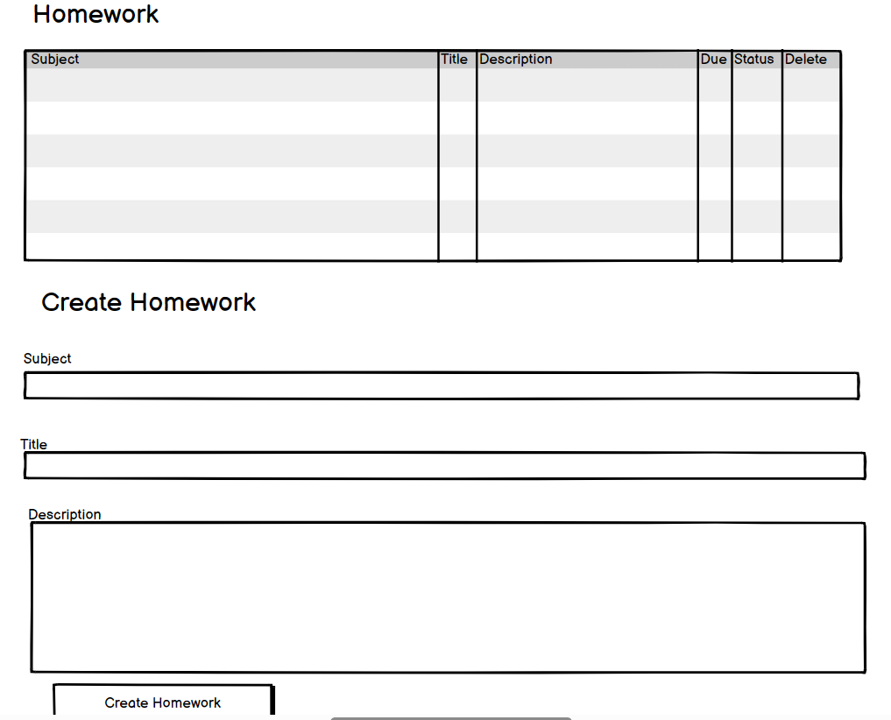
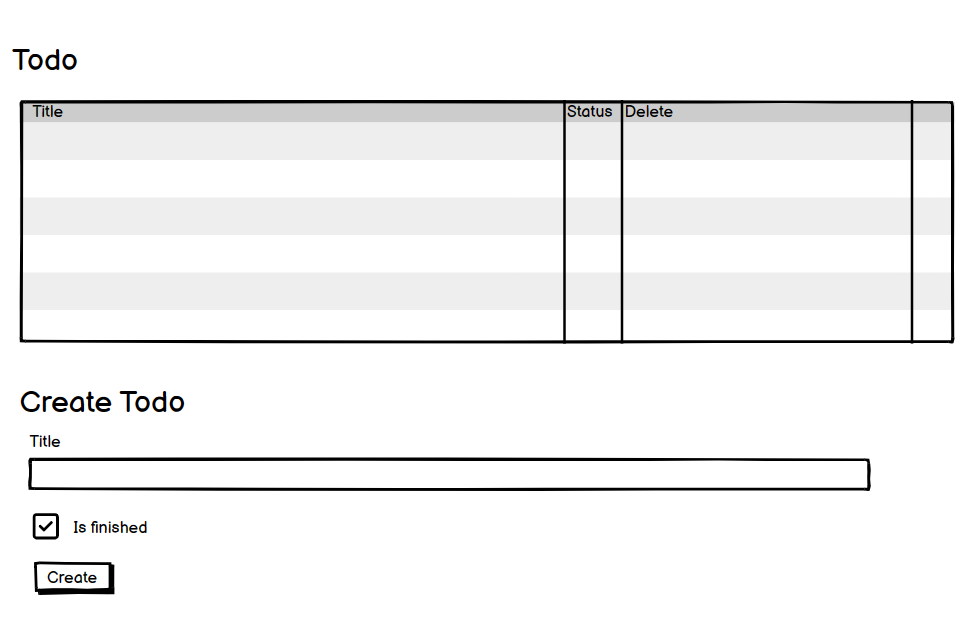
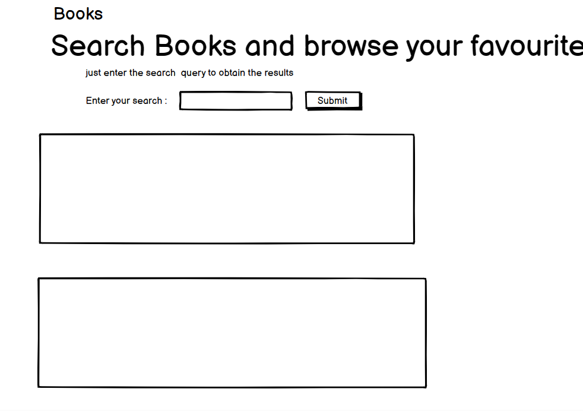
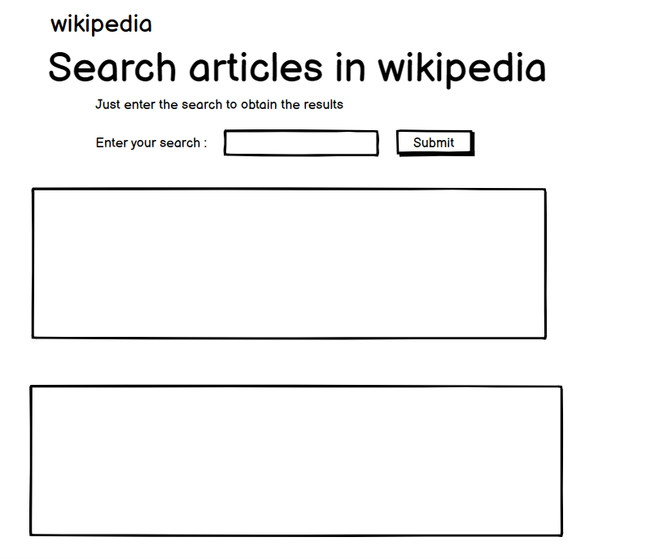
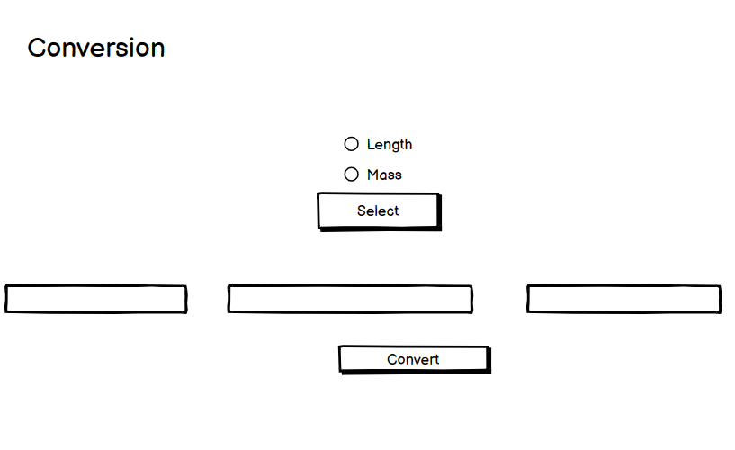

# StudentStudyPortal
# Django-WebApp      

<h2>Challenge Statement:</h2>
    <h3>The Student Management System (SMS) is a piece of software produced by the school to keep track of and manage all the data it generates, including information about a student’s grades, attendance, interpersonal activity logs, etc.</h3>
    <h3>Build a functional prototype of a platform that gives students an array of digital academic and social tools to stay engaged with their studies, peers and broader university community during pandemic.</h3>

    

<h2>Solution Approach:</h2>
    <h3> StudentStudyPortal is a portal with following features in its dashboard to make student's life easy and more manageable.</h3> 
    <ol>
        <li>Notes : Users can create text notes and refer them later, they are stored permanently until deleted.</li>
        <li>Homework: Users can add homeworks and assign them deadlines, they will be displayed prioritised by deadlines.</li>
        <li>Youtube Search: Users can perform Youtube search and select desired video to play it on youtube.</li>
        <li>To Do: Users can add to-do lists for their day and remove them as the work is finished.</li>
        <li>Books: Users can browse books from a list of neatly organised book menu.</li>
        <li>Dictionary: Users can enter a word, and the meaning will be displayed along with its phonetic description instantaneously.</li>
        <li>Wikipedia: Users can search wikipedia to get fast results.</li>
        <li>Expense Tracker: A virtual wallet is implemented to help the users to manage their expenses and keep track of it.</li>
        <li>Profile : This will display all the pending todos and homeworks to the users.</li>
    </ol>
    
<h2>Technologies Used:</h2>
<ul>
    <li>Python</li>
    <li>Django</li>
    <li>Bootstrap</li>
    <li>JavaScript</li>
</ul>
    
<h2>Additional Python Modules Required:</h2>
<ul>
    <li>Django</li>
    <li>django-crispy-forms</li>
    <li>youtubesearchpython</li>
    <li>wikipedia</li>
</ul>

<h2>APIs Required:</h2>
<ul>
    <li>Dictionary API </li>
    <li>Google e-books API</li>
</ul>
  
<h2>Note :</h2>

<b>The Secret_Key required for the execution and debugging of project is not removed from the project code.</b>
  
<h2>Usage :</h2>

    python django_web_app/manage.py makemigrations

    python django_web_app/manage.py migrate

    python django_web_app/manage.py runserver
    
   In your web browser enter the address : http://localhost:8000 or http://127.0.0.1:8000/
   
<h2>Admin Login Credentials for database :</h2>
<ul>
  <li>Username : root</li>
  <li>Password : 1234</li>
 In your web browser enter the address : http://127.0.0.1:8000/admin to view the database structure 
</ul>

## UX Design
The Student Study Portal website is designed to be simple and easy to navigate. The site has a responsive design to provide an optimal viewing experience across a wide range of devices.

### Site Structure
The website has 8 main pages with a clear and semantic structure, the information is well organized, every element is easy to find. The consistency and similarity of the structure is manifested on all pages and sections of the site and covers interactivity.

### Wireframes
The wireframes were created using [Balsamiq](https://balsamiq.com/). Here are some initial wireframes created at the beginning of the project. The final design may differ from the initial wireframes.

*Home Page*

*Notes Page*

*Homework Page*

*Youtube Page*

*Todo Page*

*Books Page*

*Wikipedia Page*

*Conversion Page*

<h2>Features</h2>

(docs/images/wireframes/11.png)
#docs/images/wireframes/12.png)
docs/images/wireframes/14.png)
docs/images/wireframes/15.png)
docs/images/wireframes/16.png)
docs/images/wireframes/17.png)
docs/images/wireframes/18.png)

